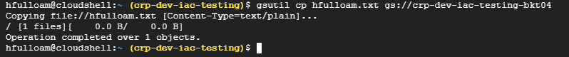

# Ejercicio - GCS

## Bucket
gsutil mb -p crp-dev-iac-testing -c NEARLINE -l us-east4 -b on gs://crp-dev-iac-testing-bkt04

## Crear archivo en Home con el comando:

touch JuanCodigoLiv.txt

## Copia de archivo de Home a Bucket con el comando:

gsutil cp kicuevas.txt gs://crp-dev-iac-testing-bkt04

## Copia de archivo de Bucket a home con el comando:

gsutil cp gs://crp-dev-iac-testing-bkt04/JuanCodigoLiv.txt .

## Etiqueta

gsutil label ch -l gitautomaticteam:ejercicio-1 gs://crp-dev-iac-testing-bkt04

## Integrantes

| Participa | Integrantes |
| :-------: | :-------------: |
| si        |hfulloam         |
| si        |eaalmonasis      | 
| si        |Evelin           | 
| si        |Karla            | 
| si        |JuanCodigoLiv    |
