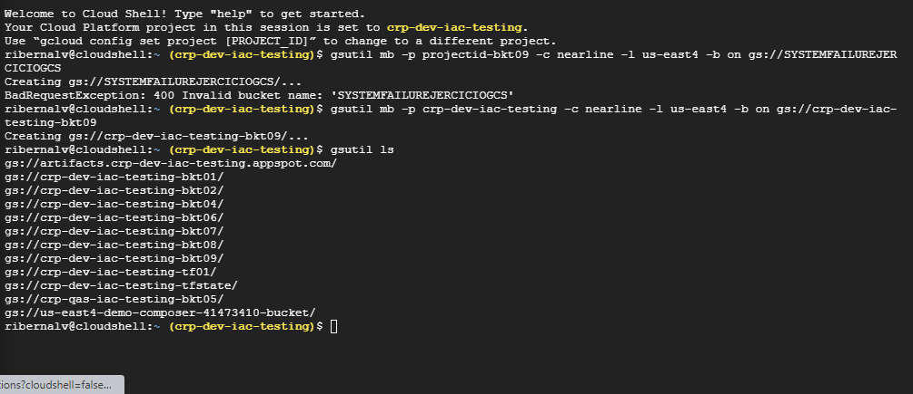
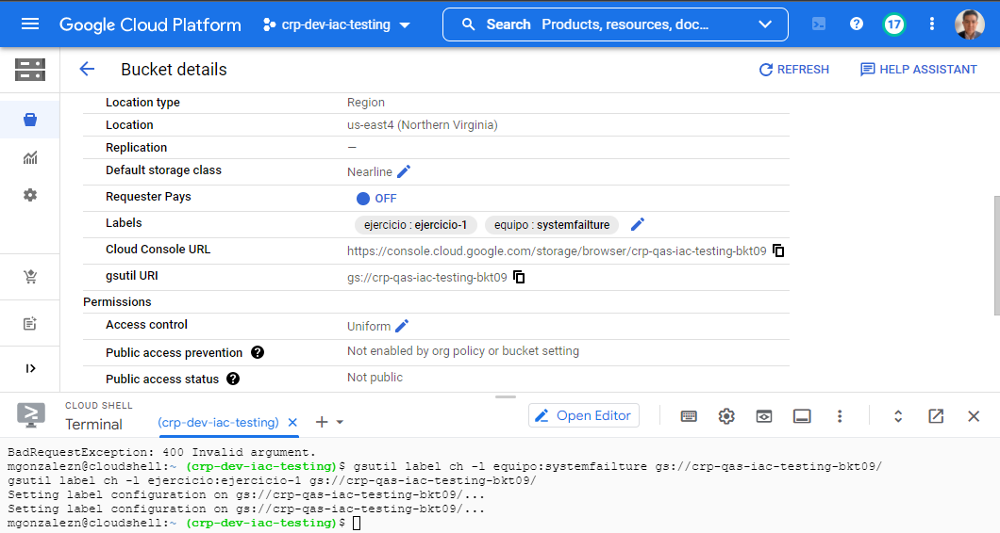
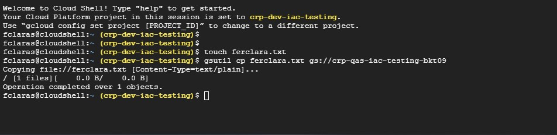

    | Nombre | Equipo |
    ------------------
    | Fernando Clara Suazo | systemfailure |
    | Mauricio Gonzalez Neri | systemfailure |
    | Rosa Isela Bernal | systemfailure |
    | Jose Luis Santelis | systemfailure |

# 
 "Ejercicio 1" 

## 
 "Creación de Bucket"
### 
 *Comando*

gsutil mb -p crp-qas-iac-testing -c nearline -l us-east4 -b on gs://crp-dev-iac-testing-bkt09

## 
 "Asignación de etiquetas"
### 
 *Comando*

gsutil label ch -l equipo:systemfailture gs://crp-qas-iac-testing-bkt09/

gsutil label ch -l ejercicio:ejercicio-1 gs://crp-qas-iac-testing-bkt09/

## 
 "Creación de archivo"
### 
 *Comando*

touch ferclara.txt
gsutil cp ferclara.txt gs://crp-qas-iac-testing-bkt09

